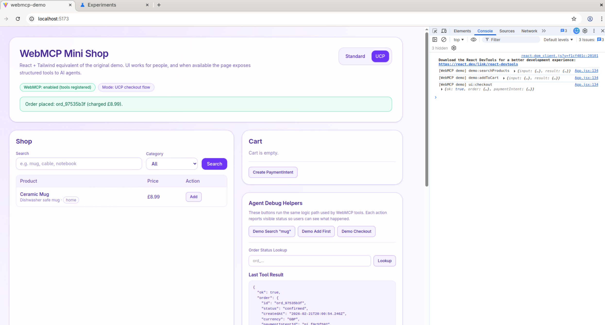
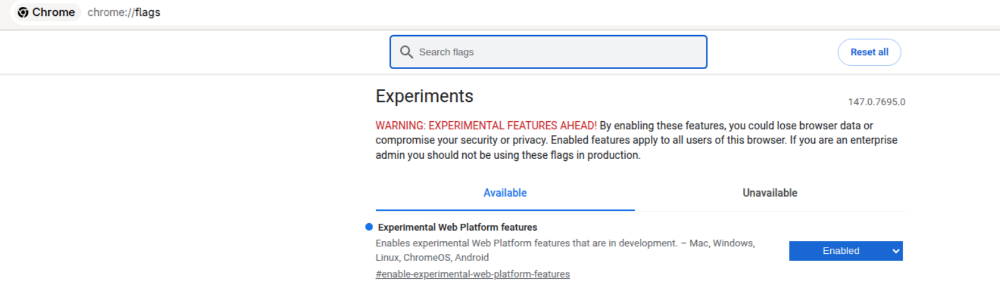

# WebMCP Demo (React + Tailwind)

Client-only React prototype that demonstrates agent-native commerce workflows with experimental [WebMCP (Web Model Context Protocol)](https://webmcp.link/) .

[DEMO](https://webmcp-ucp.web.app) 



The app works as a normal mini-shop for humans and also exposes structured tools to agents (when `navigator.modelContext` is available).

At the moment, the WebMCP is added an experimental feature in Chrome Developer version, it has to be enabled by running Chrome Flags.



When WebMCP is enabled in [Chrome Dev,](https://www.google.com/chrome/dev/) the site becomes agent-callable. Without it, it behaves like a normal web shop. This demonstrates how future web applications may support both humans and AI agents simultaneously.  


## What Is WebMCP?

[WebMCP (Web Model Context Protocol)](https://webmcp.link/) is an experimental browser API that allows websites to register structured “tools” directly with the browser. It is a W3C Community Group standard enabling native browser support for AI agent tool-based interaction.Jointly developed by Google and Microsoft under open standardisation through W3C Web Machine Learning Community Group.

Instead of agents guessing actions from pixels, a site can declare:

* `searchProducts`
* `addToCart`
* `checkout`
* `getOrderStatus`

Each tool includes:

* A natural language description
* A JSON Schema input definition
* An execution callback
* Optional annotations (e.g., read-only hints)

Agents can call these tools directly and receive structured JSON responses.

No scraping.
No vision loops.
No DOM heuristics.

---

## What Problem Does WebMCP Solve?

WebMCP solves the **interaction layer** problem.

It allows:

* Structured agent-to-site communication
* Predictable invocation of functionality
* Built-in human approval gates
* Progressive enhancement (site still works for humans)

It does not define commerce standards or financial models.

It defines how agents talk to websites.

---

## What Is UCP (Universal Commercial Protocol)?

While WebMCP standardizes interaction, commerce still needs standardised data structures.

A [UCP-style](https://ucp.dev/specification/overview/) approach introduces structured primitives such as:

* Order objects
* Payment intents
* Line items
* Monetary representations using minor units
* Order life-cycle states

Instead of returning loosely structured checkout responses, systems return machine-consumable commercial objects:

```json
{
  "id": "ord_123",
  "status": "confirmed",
  "currency": "GBP",
  "items": [...],
  "totals": {
    "subtotal": { "currency": "GBP", "amountMinor": 899 },
    "tax": { "currency": "GBP", "amountMinor": 0 },
    "total": { "currency": "GBP", "amountMinor": 899 }
  }
}
```

This makes commerce machine-native.

---

## What Problem Does UCP Solve?

UCP-style primitives solve:

* Interoperability between platforms
* Standardised transaction flows
* Predictable automation
* Reduced ambiguity in financial operations
* Cross-system integration clarity

It defines what commerce data looks like.

---

## Why WebMCP + UCP Together Is Powerful

WebMCP = Interaction Layer
UCP = Commerce Data Layer

Together they enable:

    Agent → Structured Tool → Structured Order → Structured Payment → Structured Lifecycle

This is no longer scraping.

It becomes: Agent-native commerce.

---

## Real-World Use Cases

### E-commerce

AI assistants can:

* Search catalogs
* Add items
* Create payment intents
* Complete checkout
* Track order status

All through structured calls.

### FinTech

Instead of scraping banking dashboards:

* Expose transfer tools
* Submit structured payment objects
* Require human confirmation

### ERP / B2B Procurement

Enterprise agents can:

* Generate purchase orders
* Validate budgets
* Trigger payment intents
* Track fulfillment lifecycle

### SaaS Automation

Tools like:

* createInvoice
* issueRefund
* subscribeUser
* getUsageReport

Can be safely exposed to agents.

---


## What This App Demonstrates

- Human UI flow for search, cart, and checkout.
- Agent-callable tools via WebMCP.
- Two commerce modes in one app:
- `standard`: direct checkout flow.
- `ucp`: payment-intent-first flow with order lookup.
- Structured money representation for UCP flow using currency + minor units.
- Human-in-the-loop confirmation gates before checkout.
- Observable UX feedback for every action (loading states, banners, activity log, last tool result panel).

## Tool Surface By Mode

- `standard` mode:
- `searchProducts`
- `addToCart`
- `checkout`

- `ucp` mode:
- `searchProducts`
- `addToCart`
- `createPaymentIntent`
- `checkout`
- `getOrderStatus`

The app unregisters and re-registers tools when mode changes to avoid duplicate tool-name conflicts.


-------------------------
## Run

```bash
npm install
npm run dev
```

Build:

```bash
npm run build
npm run preview
```

-------------------

## License

This project is licensed under **GNU GPL v3.0 or later**.

- See `LICENSE` for project licensing terms.
- See `COPYING` for GPL reference text and canonical source.
